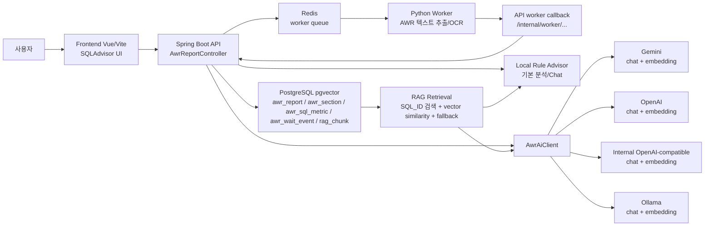
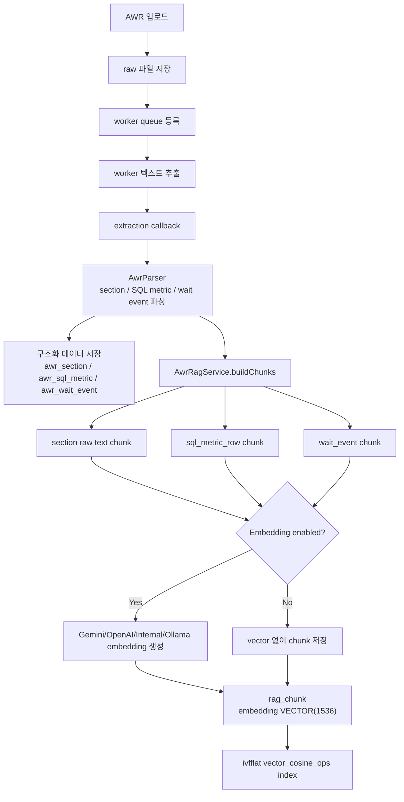
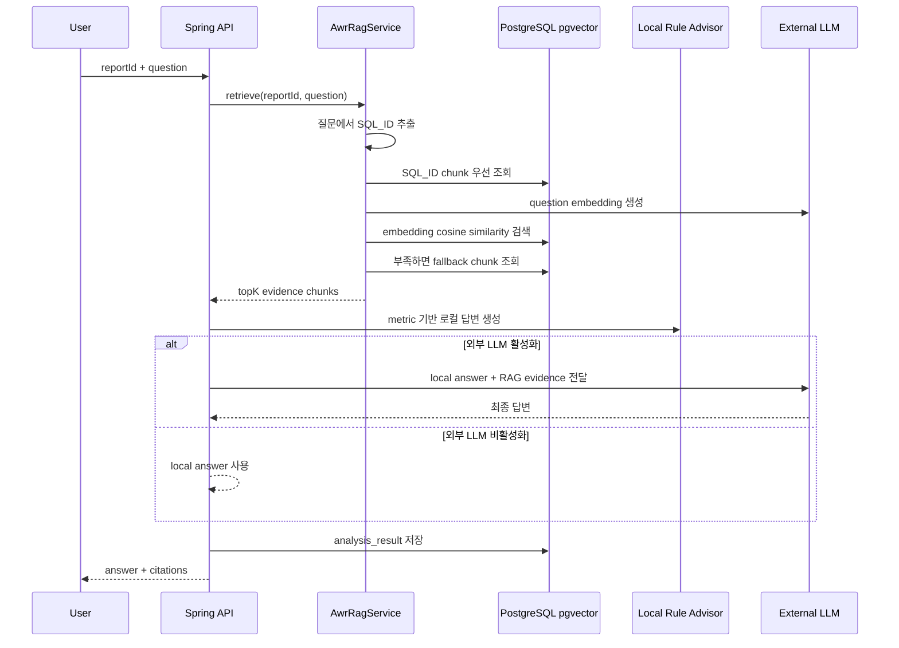

# RAG Architecture

SQLAdvisor의 RAG 구성은 Oracle AWR 리포트에서 추출한 구조화 지표와 원문 근거를 `pgvector`에 저장하고, Advisor 분석/Chat 시 질문과 관련된 chunk를 검색해 답변 근거로 사용하는 구조입니다.

## 기본 설정

tracked `deploy/config/application-*.yml`과 `deploy/.env.*.example` 기준 기본 AI/RAG 설정은 다음과 같습니다.

| 항목 | 값 |
| --- | --- |
| LLM provider | `local` |
| Embedding provider | `none` |
| Chat model | `rule-based-local-advisor` |
| Embedding model | `none` |
| RAG top-k | `8` |
| Embedding dimension | `1536` |
| Vector store | PostgreSQL `pgvector` |

런타임에서는 실제 `deploy/.env.dev`, `deploy/.env.prod` 또는 `/api/config/ai`로 조회되는 DB 저장 설정이 기본값보다 우선 적용될 수 있습니다.

## 전체 구성도

## RAG 인덱싱 흐름

## Chat/Analyze 검색 흐름

## 주요 컴포넌트

| 컴포넌트 | 역할 |
| --- | --- |
| `AwrReportService` | 업로드, worker callback, 분석/Chat 요청 흐름을 조율합니다. |
| `AwrParser` | AWR 텍스트에서 header, section, SQL metric, wait event를 추출합니다. |
| `AwrRagService` | RAG chunk 생성, embedding 생성 요청, 검색, citation 생성을 담당합니다. |
| `AwrRepository` | `rag_chunk` 저장, SQL_ID 검색, pgvector 유사도 검색, fallback 검색을 수행합니다. |
| `AwrAiClient` | OpenAI, Gemini, 내부 OpenAI-compatible endpoint, Ollama chat/embedding API 호출을 담당합니다. |
| `AwrLlmAdvisor` | 로컬 분석 결과와 RAG evidence를 외부 LLM 프롬프트에 결합합니다. |
| `AwrAdvisor` | 외부 LLM 없이도 동작하는 규칙 기반 분석/Chat 답변을 생성합니다. |

## 데이터 저장 구조

RAG chunk는 `rag_chunk` 테이블에 저장됩니다.

| 컬럼 | 설명 |
| --- | --- |
| `report_id` | AWR 리포트 ID |
| `section_name` | 원본 AWR 섹션명 |
| `sql_id` | SQL metric chunk인 경우 SQL_ID |
| `chunk_text` | 검색과 LLM 근거로 쓰는 텍스트 |
| `chunk_type` | `sql_metric_row`, `wait_event`, `summary` 등 chunk 유형 |
| `metric_json` | chunk에 연결된 구조화 지표 |
| `embedding` | `VECTOR(1536)` pgvector embedding |
| `embedding_provider` | embedding 생성 provider |
| `embedding_model` | embedding 모델명 |
| `embedding_dimension` | embedding 차원 |

`embedding` 컬럼에는 `ivfflat` + `vector_cosine_ops` 인덱스가 생성됩니다.

## 검색 전략

`AwrRagService.retrieve(reportId, question)`는 다음 순서로 evidence chunk를 모읍니다.

1. 질문에서 13자리 SQL_ID 패턴을 찾습니다.
2. SQL_ID가 있으면 해당 SQL_ID의 chunk를 먼저 조회합니다.
3. embedding provider가 활성화되어 있으면 질문 embedding을 생성하고 pgvector cosine similarity로 유사 chunk를 조회합니다.
4. 결과가 `top-k`보다 적으면 fallback chunk를 채웁니다.
5. 중복을 제거한 뒤 최대 `top-k`개를 반환합니다.

fallback 우선순위는 `sql_metric_row`, `wait_event`, `time_model`, `summary`, 기타 순서입니다.

## 현재 제한사항

- Cohere rerank는 환경 변수와 설정 항목만 있고, 현재 검색 파이프라인에는 rerank 단계가 없습니다.
- Anthropic/xAI 설정 항목은 있지만, 현재 `AwrAiClient`의 실제 chat/embedding 호출 구현은 OpenAI, Gemini, 내부 OpenAI-compatible endpoint, Ollama 중심입니다.
- Advisor 답변은 AWR에서 추출된 지표와 RAG evidence만 사용합니다. 실행계획, bind 값, DDL, object statistics, ASH, SQL Monitor가 없으면 원인 판단은 가설 수준입니다.

## 관련 파일

| 파일 | 설명 |
| --- | --- |
| `sqladvisor/src/main/java/dbinc/sqladvisor/domain/awr/service/AwrReportService.java` | 분석/Chat 및 worker callback 흐름 |
| `sqladvisor/src/main/java/dbinc/sqladvisor/domain/awr/service/AwrRagService.java` | RAG 인덱싱/검색 |
| `sqladvisor/src/main/java/dbinc/sqladvisor/domain/awr/service/AwrRepository.java` | pgvector 테이블/쿼리 |
| `sqladvisor/src/main/java/dbinc/sqladvisor/domain/awr/service/AwrAiClient.java` | AI provider chat/embedding 호출 |
| `deploy/config/application-dev.yml` | dev AI/RAG 기본 설정 |
| `deploy/config/application-prod.yml` | prod AI/RAG 기본 설정 |
| `sqladvisor/init-db/postgres/001_pgvector.sql` | pgvector extension 및 RAG 테이블 초기화 |
